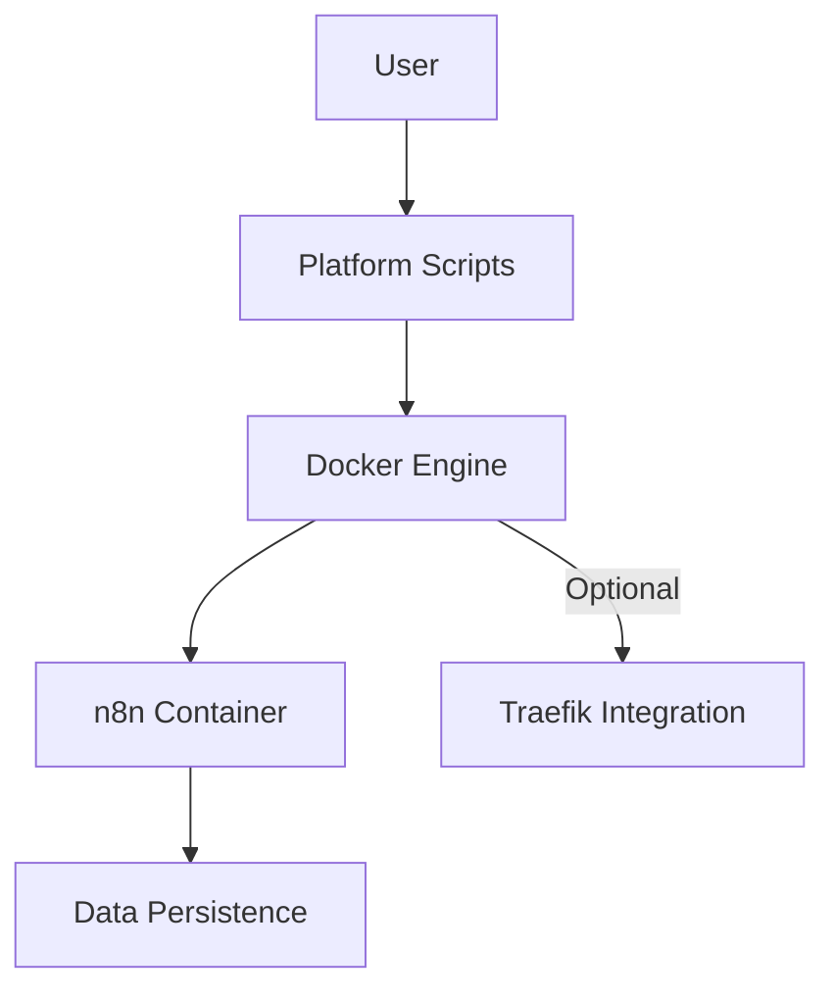

# System Patterns: n8n Setup Scripts

## Architecture Overview

The n8n Setup Scripts project follows a container-based architecture with script-driven orchestration. The system is designed to be simple yet flexible, with special consideration for cross-platform compatibility and integration with Traefik.

## Key Design Patterns

### 1. Container-Based Deployment
- **Pattern**: Using Docker containers as the deployment unit
- **Rationale**: Provides environment consistency and isolation
- **Implementation**: Docker Compose files defining the n8n service configuration

### 2. Script-Driven Orchestration
- **Pattern**: Shell/PowerShell scripts as the user interface
- **Rationale**: Abstracts Docker complexity from end-users
- **Implementation**: Platform-specific scripts that handle Docker operations

### 3. Environment Detection
- **Pattern**: Runtime detection of environment configuration
- **Rationale**: Allows dynamic adaptation to user's environment
- **Implementation**: Script checks for Traefik presence and adapts configuration accordingly

### 4. Data Persistence
- **Pattern**: Host-mapped volumes for state preservation
- **Rationale**: Ensures user data survives container restarts/rebuilds
- **Implementation**: Docker volume mapping to host directories

### 5. Integration Flexibility
- **Pattern**: Optional Traefik integration
- **Rationale**: Supports both simple standalone and advanced proxy-based deployments
- **Implementation**: Conditional compose file selection based on detected environment

## Component Relationships

### Platform Scripts
- Acts as the entry point for users
- Handles environment detection
- Orchestrates Docker operations
- Provides feedback to users

### Docker Configuration
- Defines the n8n container configuration
- Sets appropriate environment variables
- Configures network settings
- Establishes volume mappings for persistence

### Traefik Integration
- Optional component for advanced setups
- Handles routing and DNS resolution
- Provides an alternative access method to the standard port mapping

## Technical Decisions

1. **Use of Docker Compose**: 
   - Selected for simplifying multi-container management
   - Provides declarative configuration rather than imperative commands

2. **Host Directory for Persistence**:
   - Using a consistent location in the user's home directory
   - Ensures data is preserved across container rebuilds

3. **Automatic Network Detection**:
   - Scripts check for the existence of Traefik networks
   - Creates networks if they don't exist

4. **Container Naming**:
   - Fixed container name (n8n) for easier management and logs access
   - Consistent across all deployments

5. **Environment Variable Configuration**:
   - Using environment variables for n8n configuration
   - Allows for future extensibility without script changes
