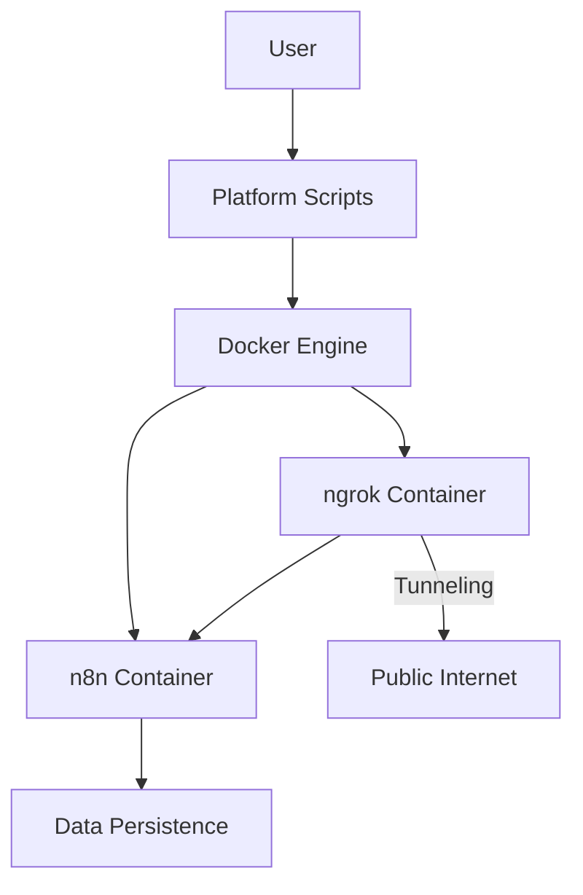

# System Patterns: n8n Setup Scripts

## Architecture Overview

The n8n Setup Scripts project follows a container-based architecture with script-driven orchestration. The system is designed to be simple yet flexible, with special consideration for cross-platform compatibility and tunneling via ngrok.

## Key Design Patterns

### 1. Container-Based Deployment
- **Pattern**: Using Docker containers as the deployment unit
- **Rationale**: Provides environment consistency and isolation
- **Implementation**: Docker Compose files defining the n8n and ngrok service configuration

### 2. Script-Driven Orchestration
- **Pattern**: Shell/PowerShell scripts as the user interface
- **Rationale**: Abstracts Docker complexity from end-users
- **Implementation**: Platform-specific scripts that handle Docker operations

### 3. Environment Configuration
- **Pattern**: Environment variables for service configuration
- **Rationale**: Allows secure and flexible configuration
- **Implementation**: .env file for storing sensitive data like ngrok authentication tokens

### 4. Data Persistence
- **Pattern**: Host-mapped volumes for state preservation
- **Rationale**: Ensures user data survives container restarts/rebuilds
- **Implementation**: Docker volume mapping to host directories

### 5. Secure Remote Access
- **Pattern**: ngrok tunneling for external access
- **Rationale**: Provides secure, public URLs without port-forwarding
- **Implementation**: ngrok container linked to n8n for automatic tunneling

## Component Relationships

### Platform Scripts
- Acts as the entry point for users
- Manages environment file creation and validation
- Orchestrates Docker operations
- Provides feedback to users including tunneling URLs

### Docker Configuration
- Defines the n8n and ngrok container configuration
- Sets appropriate environment variables
- Establishes volume mappings for persistence
- Configures container dependencies and networking

### ngrok Integration
- Provides secure tunneling to the n8n instance
- Creates public URLs for external access
- Authenticates using token from .env file
- Automatically connects to the n8n container

## Technical Decisions

1. **Use of Docker Compose**: 
   - Selected for simplifying multi-container management
   - Provides declarative configuration rather than imperative commands

2. **Host Directory for Persistence**:
   - Using a consistent location in the user's home directory
   - Ensures data is preserved across container rebuilds

3. **Environment File Management**:
   - Scripts create and manage .env files for configuration
   - Auto-detection of required authentication tokens
   - Secure storage of sensitive credentials

4. **Container Naming**:
   - Fixed container names (n8n, n8n-ngrok) for easier management
   - Consistent across all deployments for simplified logs access

5. **Environment Variable Configuration**:
   - Using environment variables for service configuration
   - Separation of service-specific and shared configuration
   - Clear feedback when required variables are missing
